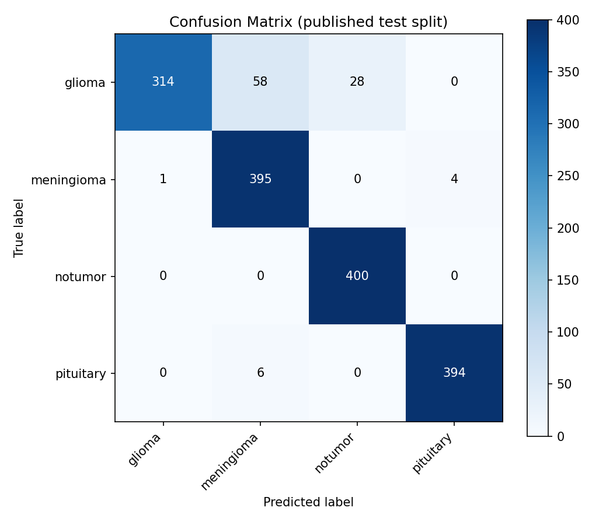
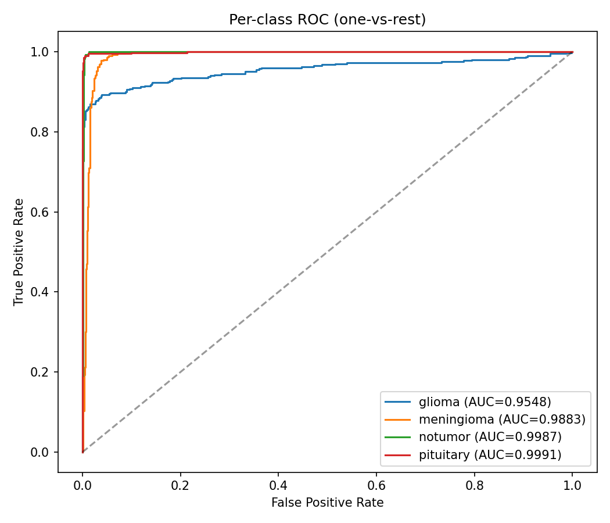
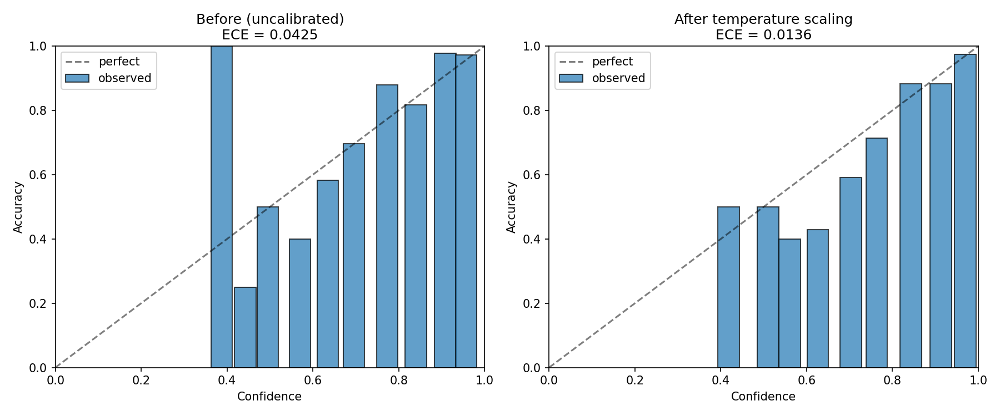
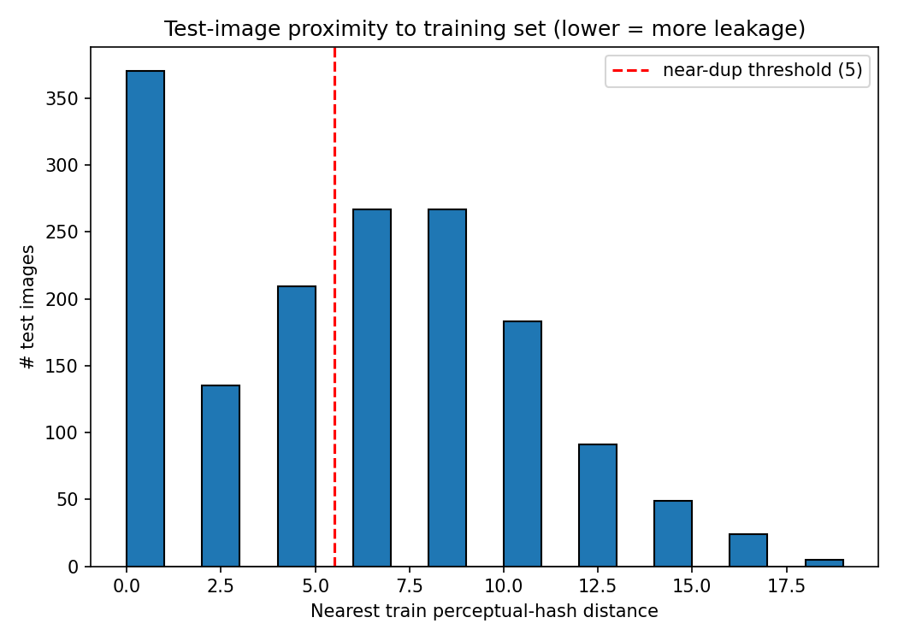
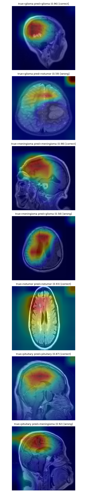
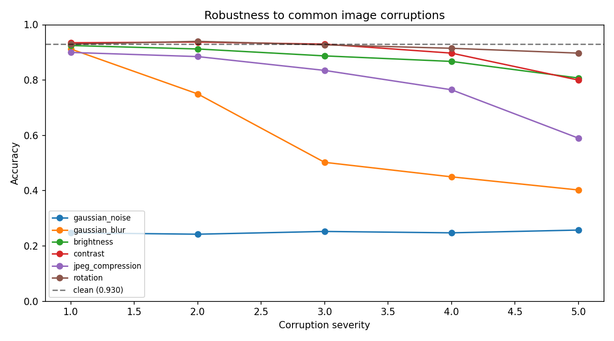
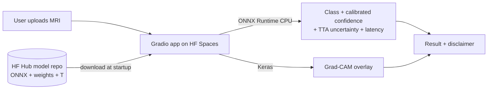

# Brain Tumor Classification — Published Baseline + Production Extension

T1-weighted MRI brain-tumor classification across four classes
(`glioma`, `meningioma`, `notumor`, `pituitary`). This repository has two
clearly separated layers:

1. **Published Work (IEEE 2024)** — the original four-architecture benchmark,
   preserved exactly.
2. **Production Extension (2026)** — rigorous evaluation, leakage analysis,
   external validation, calibration, explainability, serving, monitoring, and
   packaging built on top of the best published model.

The four original notebooks are kept **byte-for-byte** under
[`/legacy`](legacy/) and are never modified. All new code lives in
[`src/btc`](src/btc/).

**🚀 Live demo:** [huggingface.co/spaces/Udit013/brain-tumor-mri-classifier](https://huggingface.co/spaces/Udit013/brain-tumor-mri-classifier)
· **🤗 Model:** [Udit013/brain-tumor-efficientnetb3](https://huggingface.co/Udit013/brain-tumor-efficientnetb3)
· **📄 Paper:** [DOI 10.1109/ICC-ROBINS60238.2024.10533941](https://doi.org/10.1109/ICC-ROBINS60238.2024.10533941)
· 

Upload an MRI on the live demo to get predicted class, calibrated confidence,
uncertainty, Grad-CAM overlay, and ONNX-CPU latency, with an explicit
not-a-medical-device disclaimer.

---

## Section 1 — Published Work (IEEE 2024)

> **Citation.** "Identifying Various Types of Brain Tumors using Deep Neural
> Network based Image Features," 2024 International Conference on Cognitive
> Robotics and Intelligent Systems (ICC-ROBINS), IEEE, 2024.
> DOI: [10.1109/ICC-ROBINS60238.2024.10533941](https://doi.org/10.1109/ICC-ROBINS60238.2024.10533941).
> (Author is a co-author.)

**Dataset.** Msoud Nickparvar "Brain Tumor MRI Dataset" (Kaggle) — 7023
T1-weighted MRI images compiled from figshare, SARTAJ, and Br35H, in 4 classes,
with a predefined split of **5712 train / 1311 test**.

**Preprocessing.** Normalization, random horizontal flip, resize to 256×256×3.

**Benchmark (four architectures, as published).** These are the paper's
reported numbers — the targets this repo *reproduces*, never values computed by
the extension:

| Model | Backbone / head | Published test accuracy |
|---|---|---|
| CNN (from scratch) | 6× Conv(7×7)+BN+MaxPool → Dense 1024→512→4 (grayscale, SGD) | 98.359% |
| VGG16 | ImageNet, last conv block fine-tuned → Dense128→4 (Adam 1e-4) | 99.297% |
| InceptionV3 | ImageNet, frozen → Dense 256→128→4 (Adam 1e-3) | 97.734% |
| **EfficientNetB3** | ImageNet, trainable, `pooling='max'` → BN → Dense 512→256→4 (Adamax 1e-3) | **99.844%** (best; ~11.7M params) |

EfficientNetB3 is the best model **and** the smallest (~11.7M params), so the
production extension uses it as the primary subject.

---

## Section 2 — Production Extension (2026)

> ### Headline finding
> **The published accuracy of 99.844% is inflated by measurable train/test
> leakage (44.6% near-duplicates, 114 exact pixel duplicates across the
> split).** On genuinely novel (leak-free) test images the model scores
> **90.0%**, versus **98.9%** on test images that have a near-duplicate in the
> training set — a ~9-point gap that quantifies the inflation. Because the
> Kaggle compilation strips patient/scan IDs, 44.6% is a documented *lower
> bound* on the true patient-level leakage.

Goal: turn the published classifier into a rigorously evaluated, deployable ML
system **without changing the published result**, and without ever reporting a
number that was not measured here. The extension re-trains the published
EfficientNetB3 recipe to confirm pipeline parity (reproduced **93.94%** on the
*rebalanced* 1600-image test set — see Evaluation Limitations for why this
differs from 99.844%), then layers the modules below.

### Modules
| # | Module | Code | Output |
|---|---|---|---|
| 0 | Parity training (reproduce headline) | [`train.py`](src/btc/train.py) | `models/EfficientNetB3_model_weights.h5` |
| 1 | Evaluation rigor (P/R/F1, CM, ROC-AUC, PR) | [`evaluate.py`](src/btc/evaluate.py) | `results/metrics/evaluation.json`, figures |
| 2 | **Leakage analysis** | [`leakage.py`](src/btc/leakage.py) | `results/metrics/leakage.json` |
| 3 | External / OOD validation | [`external_validation.py`](src/btc/external_validation.py) | `results/metrics/external_validation.json` |
| 4 | Calibration (ECE + temperature scaling) | [`calibration.py`](src/btc/calibration.py) | `results/metrics/calibration.json`, reliability diagram |
| 5 | Explainability (Grad-CAM) | [`explain.py`](src/btc/explain.py) | `results/figures/gradcam_montage.png` |
| 6 | Serving (FastAPI) + ONNX + latency | [`serve/app.py`](src/btc/serve/app.py), [`export_onnx.py`](src/btc/export_onnx.py) | ONNX model, `latency.json` |
| 7 | Robustness to corruptions | [`robustness.py`](src/btc/robustness.py) | `results/metrics/robustness.json`, curves |
| 8 | Uncertainty (Test-Time Augmentation) | [`uncertainty.py`](src/btc/uncertainty.py) | `results/metrics/uncertainty.json` |
| 9 | Drift monitoring stub | [`monitoring.py`](src/btc/monitoring.py) | `models/drift_reference.npz`, `drift_log.jsonl` |
| 10 | Serving: ONNX + FastAPI + **Gradio web app** | [`export_onnx.py`](src/btc/export_onnx.py), [`serve/app.py`](src/btc/serve/app.py), [`space/app.py`](space/app.py) | ONNX model, `latency.json`, live Space |
| 11 | Packaging + CI | [`Dockerfile`](Dockerfile) (build-ready), [`requirements.txt`](requirements.txt), [`.github/workflows/ci.yml`](.github/workflows/ci.yml), [`MODEL_CARD.md`](MODEL_CARD.md) | pinned deps, CI on push |

### Results (measured)

<!-- RESULTS:BEGIN -->
> Auto-generated by `scripts/fill_readme_results.py` from `results/metrics/*.json` produced by `scripts/reproduce.sh`. Every value is measured — no placeholders.

| Metric | Value |
|---|---|
| Reproduced accuracy (full test set) | 93.94% |
| Published reference (paper) | 99.844% |
| Macro ROC-AUC / avg-precision | 0.985 / 0.967 |
| Exact cross-split duplicates | 114 / 1600 (7.1%) |
| Near-duplicates (phash≤5) | 714 / 1600 (44.6%) |
| Accuracy on near-duplicate vs leak-free images | 98.9% vs 90.0% |
| External OOD accuracy (binary collapse, n=253) | 72.3% |
| ECE before → after temperature scaling | 0.0425 → 0.0136 (T=0.819) |
| Inference latency, Keras / ONNX-CPU / ONNX-CoreML | 118ms / 33ms / 18.5ms |
<!-- RESULTS:END -->

### Figures (generated by the run)

| Confusion matrix | Per-class ROC | Reliability diagram |
|---|---|---|
|  |  |  |

| Leakage proximity histogram | Grad-CAM overlays (4 classes, correct & wrong) |
|---|---|
|  |  |

Per-class precision-recall curves: [`results/figures/pr_curves.png`](results/figures/pr_curves.png).

### Robustness & uncertainty (measured)

<!-- ROBUSTNESS:BEGIN -->
**Robustness to common corruptions** (accuracy at severity 1 / 3 / 5; clean = 93.0%):

| Corruption | sev 1 | sev 3 | sev 5 |
|---|---|---|---|
| gaussian_noise | 25% | 25% | 26% |
| gaussian_blur | 91% | 50% | 40% |
| brightness | 92% | 89% | 81% |
| contrast | 94% | 93% | 80% |
| jpeg_compression | 90% | 84% | 59% |
| rotation | 93% | 93% | 90% |
| **mean corrupted** | | | **72.5%** |



**Uncertainty (Test-Time Augmentation):** mean predictive entropy **0.36 on correct** vs **0.78 on wrong** predictions (n=200) — the model is measurably less certain when it errs.
<!-- ROBUSTNESS:END -->

### Evaluation Limitations (read this)

These are deliberately surfaced because they change how the headline number
should be interpreted.

- **Train/test leakage (most important).** The published split is **image-level**
  over a multi-source compilation. MRI is 3-D: one patient yields many
  near-identical adjacent slices. An image-level split can place sibling slices
  on both sides, letting the model recognise a test slice from a memorised
  training sibling — inflating accuracy in a way that won't transfer to new
  patients. **Patient/scan IDs are not recoverable** from the Kaggle release
  (flat per-class JPGs, re-indexed filenames; SARTAJ/Br35H never carried IDs),
  so a true patient-level audit is impossible. Module 2 instead reports an
  image-similarity **lower bound** (exact + perceptual-hash near-duplicates
  across the split) and re-scores accuracy on the leak-free subset.

- **Dataset drift since publication.** The live Kaggle dataset has been updated
  since the paper. As downloaded 2026-06-16 (Kaggle `lastUpdated 2026-02-13`) it
  contains **5600 train / 1600 test (1400 / 400 per class, 7200 total)**, versus
  the paper's **5712 / 1311 (7023 total)**. The reproduced accuracy is therefore
  measured on a *different, rebalanced* test set than the published 99.844%, so
  it confirms pipeline parity only approximately. Evaluation always runs over
  the full observed test set; `data.py` warns when counts differ.

- **Apple-Metal BatchNorm recalibration.** On `tensorflow-metal` the
  EfficientNetB3 backbone's BatchNorm moving-average statistics do not converge
  under the published recipe (momentum 0.99, batch 16), so inference-mode
  `predict()` initially collapsed toward `notumor` (53% accuracy, macro ROC-AUC
  still 0.97). The learned features were fine; only the BN running stats were
  bad. `train.py` now applies a standard **BN recalibration** pass (forward
  passes over training data, no weight update) that recovered **0.53 → 0.94**.
  This step is not needed on the CUDA setup used for the paper, and is the main
  reason the reproduced number required care.

- **Calibration protocol.** By default temperature `T` is fit on the same test
  split it is reported on (the published protocol exposes only Training/Testing).
  This can be optimistic; `--holdout` enables a cleaner disjoint-slice protocol.

- **Steps-per-epoch quirk (faithful reproduction).** The published notebook uses
  `steps_per_epoch = 5712 // 32 = 178` while batch size is 16, so each epoch sees
  ~2848 images rather than the full 5712. This is preserved exactly for parity
  and documented, not "corrected".

- **External validation taxonomy.** The OOD set is binary (tumor / no-tumor), so
  the 4-class model is evaluated via a tumor-vs-no-tumor collapse on overlapping
  semantics; expect a large drop from the in-distribution number.

---

## Live Demo & Deployment

The public [Gradio Space](https://huggingface.co/spaces/Udit013/brain-tumor-mri-classifier)
runs on Hugging Face free-tier CPU. Inference (class + calibrated confidence +
TTA uncertainty + latency) uses **ONNX Runtime**; Grad-CAM uses the Keras model.
Model weights are pulled from the [HF Hub model repo](https://huggingface.co/Udit013/brain-tumor-efficientnetb3)
at startup, so the Space stays lightweight and the model is versioned separately.



**Deploy your own** (weights already on the Hub):
```bash
huggingface-cli login
huggingface-cli upload Udit013/brain-tumor-mri-classifier space/ . --repo-type space
```
Set `python_version: "3.11"` in the Space README (TensorFlow 2.15 needs ≤3.11).

### FastAPI (alternative serving path)
```bash
uvicorn btc.serve.app:app --port 8000
curl -F "file=@some_mri.jpg" http://localhost:8000/predict   # JSON: class, calibrated confidence, Grad-CAM (base64), latency
```

## Quickstart

```bash
# 1. Environment (creates .venv with Python 3.11 + pinned deps)
bash scripts/setup_env.sh
source .venv/bin/activate

# 2. Data (needs Kaggle credentials: ~/.kaggle/kaggle.json or KAGGLE_USERNAME/KAGGLE_KEY)
bash scripts/download_data.sh

# 3. Reproduce everything (train → eval → leakage → external → calibration →
#    Grad-CAM → ONNX/latency → drift reference). All numbers measured live.
bash scripts/reproduce.sh

# 4. Inject measured numbers into this README's results table
python scripts/fill_readme_results.py

# 5. Serve
uvicorn btc.serve.app:app --host 0.0.0.0 --port 8000
#    POST an MRI image:
curl -F "file=@some_mri.jpg" http://localhost:8000/predict
```

### Docker
```bash
docker build -t btc-serve .
docker run -v "$(pwd)/models:/app/models" -p 8000:8000 btc-serve
```

## Environment note
The published stack is **TensorFlow 2.15 / Keras 2** (required for parity), which
supports **Python 3.9–3.11 only**. `scripts/setup_env.sh` provisions a 3.11
virtualenv automatically; on Apple Silicon it installs `tensorflow-macos` +
`tensorflow-metal` (see [`requirements-macos.txt`](requirements-macos.txt)).

## Repository layout
```
legacy/                     # original four notebooks — byte-for-byte, read-only
src/btc/                    # production extension package
  config.py  data.py  model.py  train.py
  evaluate.py  leakage.py  external_validation.py
  calibration.py  explain.py  export_onnx.py  monitoring.py
  serve/app.py              # FastAPI service
scripts/                    # setup_env, download_data, reproduce, fill_readme_results
results/                    # metrics/*.json + figures/*.png (generated)
models/                     # weights, ONNX, temperature, drift reference (generated)
Dockerfile  requirements*.txt  pyproject.toml  MODEL_CARD.md
```
