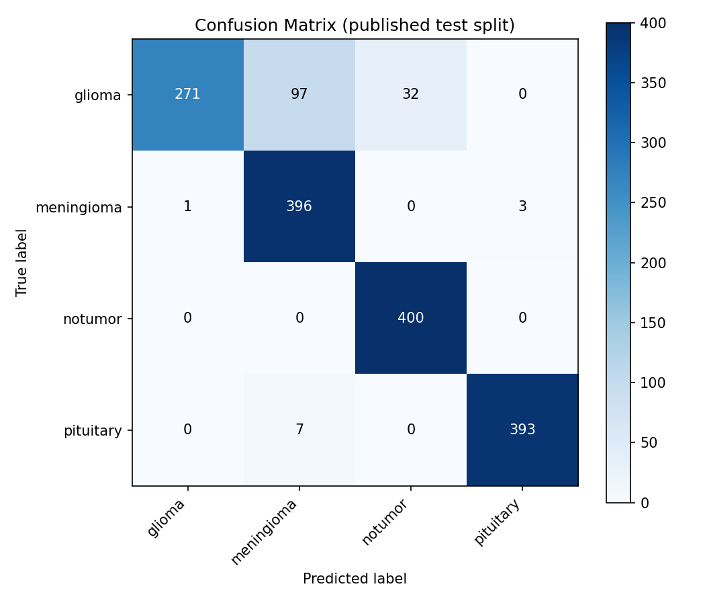
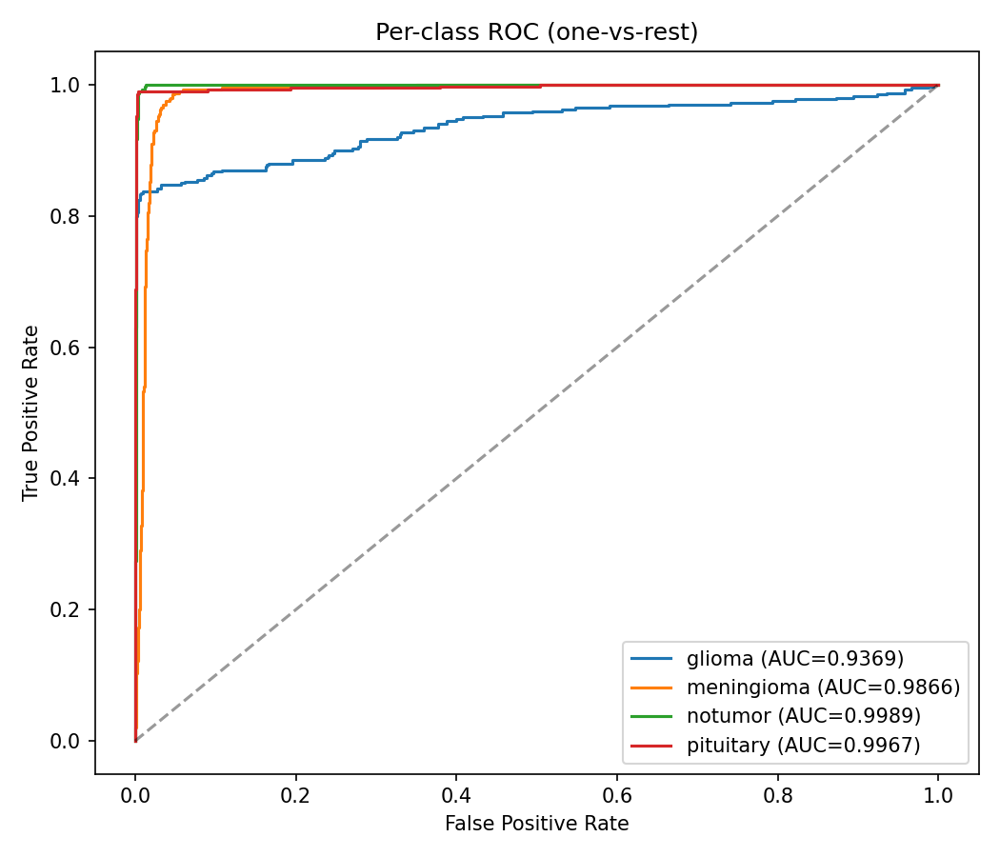
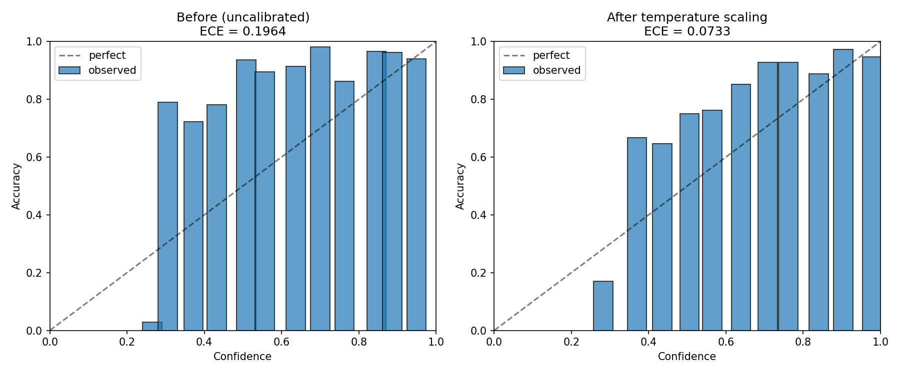
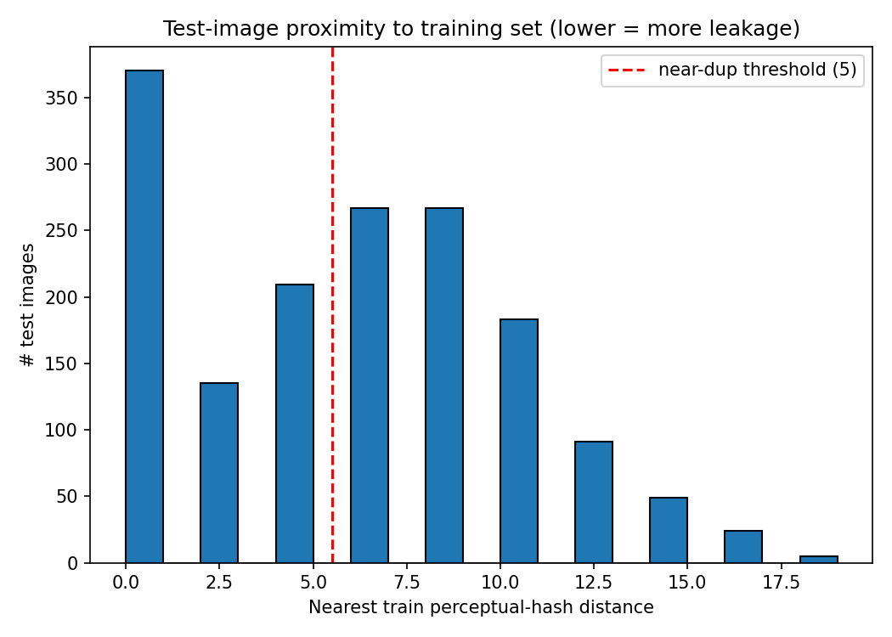
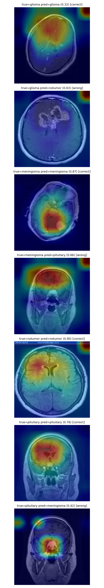
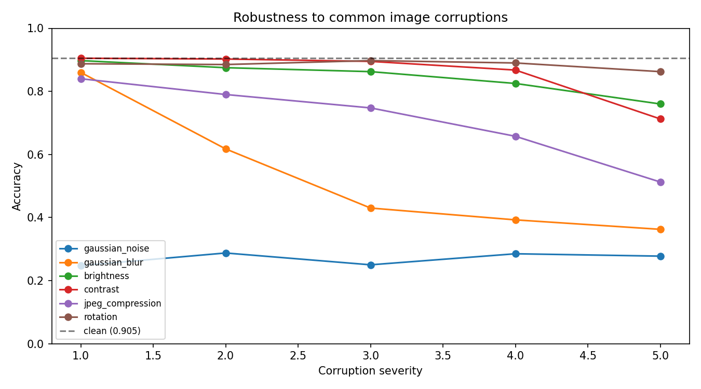
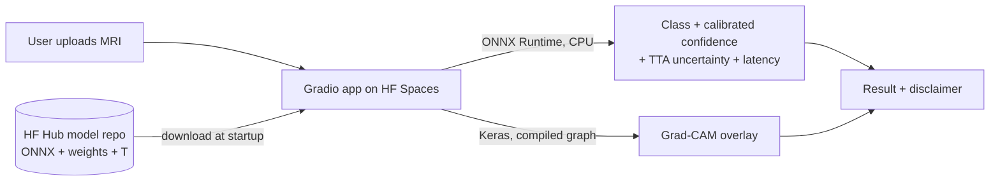

# NeuroClass — Brain Tumor MRI Classification

**Published baseline (IEEE 2024) + an audited, production-hardened extension.**

T1-weighted MRI brain-tumor classification across four classes
(`glioma`, `meningioma`, `notumor`, `pituitary`). This repository has two
clearly separated layers:

1. **Published Work (IEEE 2024)** — the original four-architecture benchmark,
   preserved byte-for-byte under [`/legacy`](legacy/) and never modified.
2. **Production Extension** — an independent audit of that benchmark plus the
   evaluation, calibration, explainability, serving, and testing work needed to
   deploy it honestly. All new code lives in [`src/btc`](src/btc/).

**🚀 Live demo:** [huggingface.co/spaces/Udit013/brain-tumor-mri-classifier](https://huggingface.co/spaces/Udit013/brain-tumor-mri-classifier)
· **🤗 Model:** [Udit013/brain-tumor-efficientnetb3](https://huggingface.co/Udit013/brain-tumor-efficientnetb3)
· **📄 Paper:** [DOI 10.1109/ICC-ROBINS60238.2024.10533941](https://doi.org/10.1109/ICC-ROBINS60238.2024.10533941)
· 

Upload an MRI to get the predicted class, a temperature-calibrated confidence,
test-time-augmentation uncertainty, a Grad-CAM overlay, and inference latency,
alongside an explicit not-a-medical-device disclaimer. The Space runs on free
CPU hardware and sleeps when idle; the first request after a sleep takes 1–2
minutes while it wakes.

---

## Section 1 — Published Work (IEEE 2024)

> **Citation.** "Identifying Various Types of Brain Tumors using Deep Neural
> Network based Image Features," 2024 International Conference on Cognitive
> Robotics and Intelligent Systems (ICC-ROBINS), IEEE, 2024.
> DOI: [10.1109/ICC-ROBINS60238.2024.10533941](https://doi.org/10.1109/ICC-ROBINS60238.2024.10533941).
> (Author is a co-author.)

**Dataset.** Msoud Nickparvar "Brain Tumor MRI Dataset" (Kaggle) — 7,023
T1-weighted MRI images compiled from figshare, SARTAJ, and Br35H, in 4 classes,
with a predefined split of **5,712 train / 1,311 test**.

**Preprocessing.** Resize to 256×256×3 RGB; random horizontal flip.

**Benchmark (four architectures, as published).**

| Model | Backbone / head | Params | Published accuracy |
|---|---|---|---|
| CNN (from scratch) | 6× Conv(7×7)+BN+MaxPool → Dense 1024→512→4 (grayscale, SGD) | 21.4M | 98.359% |
| VGG16 | ImageNet, last conv block fine-tuned → Dense 128→4 (Adam 1e-4) | 18.9M | 99.297% |
| InceptionV3 | ImageNet, frozen → Dense 256→128→4 (Adam 1e-3) | 40.7M | 97.734% |
| **EfficientNetB3** | ImageNet, trainable, `pooling='max'` → BN → Dense 512→256→4 (Adamax 1e-3) | **11.7M** | **99.844%** |

EfficientNetB3 had the top reported accuracy and the fewest parameters (38%
fewer than VGG16), so the extension uses it as the primary subject.

### What the published numbers actually measure

Re-reading the four notebooks shows every published accuracy is an exact
fraction of a **partial** test set, not the full 1,311 images. Each notebook
evaluates with `steps = 1311 // 32 = 40` batches:

| Model | Batch size | Images scored | Published accuracy | = correct / scored |
|---|---|---|---|---|
| CNN | 32 | 1,280 (98%) | 98.359% | 1,259 / 1,280 |
| VGG16 | 32 | 1,280 (98%) | 99.297% | 1,271 / 1,280 |
| InceptionV3 | 32 | 1,280 (98%) | 97.734% | 1,251 / 1,280 |
| EfficientNetB3 | **16** | **640 (49%)** | 99.844% | **639 / 640** |

Because the test generator is not shuffled, EfficientNetB3's 640 images are the
first half of the test set in file order, not a stratified sample, and the four
models were scored on different denominators. The EfficientNetB3 notebook's own
full-test-set classification report rounds to **0.99**, so the magnitude is
roughly right; the third decimal is not supported. All four notebooks also pass
the test set as `validation_data` and keep the checkpoint with the best
`val_accuracy`, so the test set influenced model selection.

---

## Section 2 — Production Extension

> ### Headline findings
> 1. **Train/test leakage inflates the benchmark.** A perceptual-hash audit
>    finds **44.6%** of test images have a near-duplicate in training (plus
>    **114** exact pixel duplicates). The model scores **97.2%** on those leaked
>    images but **86.5%** on genuinely novel ones — a ~10.7-point gap. Patient
>    IDs aren't recoverable from the compilation, so this is a *lower bound*.
> 2. **The published numbers were scored on partial test sets** (above).
> 3. **Apple's Metal GPU backend computes a different model.** The same weights
>    score 93.94% on `tensorflow-metal` but **91.25% on CPU**, disagreeing on
>    2.9% of test images. CPU TensorFlow and ONNX Runtime agree with each other
>    to 2.4e-5, and CPU is what the deployed demo runs — so **every metric below
>    is measured on CPU**, the model users are actually served.

The extension re-trains the published EfficientNetB3 recipe with exact parity,
then layers the modules below. It never reports a number that wasn't measured:
the tables in this README are written only by `scripts/fill_readme_results.py`
from the JSON files a real run produces.

### Modules
| # | Module | Code | Output |
|---|---|---|---|
| 0 | Parity training (+ BatchNorm recalibration) | [`train.py`](src/btc/train.py) | `models/EfficientNetB3_model_weights.h5` |
| 1 | Evaluation (P/R/F1, confusion matrix, ROC-AUC, PR) | [`evaluate.py`](src/btc/evaluate.py) | `results/metrics/evaluation.json`, figures |
| 2 | **Leakage audit** | [`leakage.py`](src/btc/leakage.py) | `results/metrics/leakage.json` |
| 3 | External / out-of-distribution validation | [`external_validation.py`](src/btc/external_validation.py) | `results/metrics/external_validation.json` |
| 4 | Calibration (ECE + temperature scaling) | [`calibration.py`](src/btc/calibration.py) | `results/metrics/calibration.json`, reliability diagram |
| 5 | Explainability (compiled Grad-CAM) | [`explain.py`](src/btc/explain.py) | `results/figures/gradcam_montage.png` |
| 6 | Robustness to corruptions | [`robustness.py`](src/btc/robustness.py) | `results/metrics/robustness.json`, curves |
| 7 | Uncertainty (test-time augmentation) | [`uncertainty.py`](src/btc/uncertainty.py) | `results/metrics/uncertainty.json` |
| 8 | Drift monitoring stub (PCA + PSI) | [`monitoring.py`](src/btc/monitoring.py) | `models/drift_reference.npz`, `drift_log.jsonl` |
| 9 | ONNX export + latency benchmark | [`export_onnx.py`](src/btc/export_onnx.py) | `models/efficientnetb3.onnx`, `latency.json` |
| 10 | Serving: Gradio Space + FastAPI | [`space/app.py`](space/app.py), [`serve/app.py`](src/btc/serve/app.py) | live demo, REST API |
| 11 | Packaging, tests, CI | [`Dockerfile`](Dockerfile), [`requirements.txt`](requirements.txt), [`tests/`](tests/), [`ci.yml`](.github/workflows/ci.yml), [`MODEL_CARD.md`](MODEL_CARD.md) | pinned deps, 32 tests on every push |

### Results (measured on CPU)

<!-- RESULTS:BEGIN -->
> Auto-generated by `scripts/fill_readme_results.py` from `results/metrics/*.json` produced by `scripts/reproduce.sh`. Every value is measured — no placeholders.

| Metric | Value |
|---|---|
| Reproduced accuracy (full test set) | 91.25% |
| Published reference (paper) | 99.844% |
| Macro ROC-AUC / avg-precision | 0.980 / 0.961 |
| Exact cross-split duplicates | 114 / 1600 (7.1%) |
| Near-duplicates (phash≤5) | 714 / 1600 (44.6%) |
| Accuracy on near-duplicate vs leak-free images | 97.2% vs 86.5% |
| External OOD accuracy (binary collapse, n=253) | 70.8% |
| ECE before → after temperature scaling | 0.1964 → 0.0733 (T=0.561) |
| Single-image latency, Keras-CPU / ONNX-CPU / ONNX-CoreML | 79ms / 34ms / 18.6ms |
<!-- RESULTS:END -->

### Per-class performance

<!-- PERCLASS:BEGIN -->
| Class | Precision | Recall | F1 | ROC-AUC | Support |
|---|---|---|---|---|---|
| glioma | 0.996 | 0.677 | 0.807 | 0.937 | 400 |
| meningioma | 0.792 | 0.990 | 0.880 | 0.987 | 400 |
| notumor | 0.926 | 1.000 | 0.962 | 0.999 | 400 |
| pituitary | 0.992 | 0.983 | 0.987 | 0.997 | 400 |

**Weakest class: glioma.** Of 400 glioma test images, 97 are predicted as meningioma and **32 (8.0%) as `notumor`** — a missed-tumor error, the most consequential failure mode for any screening use.
<!-- PERCLASS:END -->

### Figures (generated by the run)

| Confusion matrix | Per-class ROC | Reliability diagram |
|---|---|---|
|  |  |  |

| Leakage proximity histogram | Grad-CAM overlays (4 classes, correct & wrong) |
|---|---|
|  |  |

Per-class precision-recall curves: [`results/figures/pr_curves.png`](results/figures/pr_curves.png).

### Robustness & uncertainty (measured)

<!-- ROBUSTNESS:BEGIN -->
**Robustness to common corruptions** (accuracy at severity 1 / 3 / 5; clean = 90.5%):

| Corruption | sev 1 | sev 3 | sev 5 |
|---|---|---|---|
| gaussian_noise | 25% | 25% | 28% |
| gaussian_blur | 86% | 43% | 36% |
| brightness | 90% | 86% | 76% |
| contrast | 90% | 90% | 71% |
| jpeg_compression | 84% | 75% | 51% |
| rotation | 89% | 90% | 86% |
| **mean corrupted** | | | **68.3%** |



**Uncertainty (Test-Time Augmentation):** mean predictive entropy **0.82 on correct** vs **1.00 on wrong** predictions (n=200) — the model is measurably less certain when it errs.
<!-- ROBUSTNESS:END -->

The uncertainty signal is real but weak on this model: entropy separates
correct from wrong predictions, but the two distributions overlap heavily, so
it should be one input to a "flag for review" rule rather than a threshold on
its own.

### Evaluation limitations (read this)

- **Train/test leakage (most important).** The published split is **image-level**
  over a multi-source compilation of 3-D scans. One patient yields many
  near-identical adjacent slices, and an image-level split can place siblings on
  both sides, so the model can recognise a test slice from a memorised training
  sibling. **Patient/scan IDs are not recoverable** from the Kaggle release (flat
  per-class JPGs, re-indexed filenames; SARTAJ/Br35H never carried IDs), so the
  leakage module reports an image-similarity **lower bound** and re-scores
  accuracy on the leak-free subset.

- **The test set was used for model selection.** Both the paper's notebooks and
  this repo's parity reproduction pick the checkpoint with the best
  `val_accuracy`, where validation *is* (part of) the test set. Reported test
  metrics are therefore optimistically biased. Carving a validation split out of
  Training is the fix, and is first on the roadmap.

- **Metal vs CPU numerics.** `tensorflow-metal` 1.1.0 is used only to make
  training fast on Apple Silicon. Its kernels produce materially different
  outputs for this model (93.94% vs 91.25%), so all evaluation and serving is
  pinned to CPU by `config.configure_inference_device()`, which every model load
  goes through. Set `BTC_INFERENCE_DEVICE=gpu` to opt out. Numbers previously
  reported from Metal are superseded by the CPU numbers above.

- **BatchNorm recalibration.** Under the published recipe (momentum 0.99,
  batch 16) the backbone's BatchNorm running statistics did not converge on
  Metal, so raw inference collapsed toward one class. `train.py` re-estimates
  those statistics with forward passes over training data (no weight update).
  Re-estimating them on CPU instead was tried and scored lower on CPU (89.19% vs
  91.25%), so the current weights were kept.

- **Dataset drift since publication.** The live Kaggle dataset has been
  rebalanced since the paper: **5,600 train / 1,600 test (1,400 / 400 per
  class)** versus the paper's **5,712 / 1,311**. Reproduced numbers are on this
  different test set; `data.py` warns when counts differ.

- **Calibration protocol.** By default the temperature is fit and scored on the
  same test split. A stricter check — fit on a random half, score on the other
  half, 5 seeds — gives ECE **0.196 → 0.074 ± 0.008** with T = 0.562 ± 0.006,
  essentially the same as the default protocol, so it isn't materially
  optimistic here. `python -m btc.calibration --holdout 0.5` runs that protocol.

- **Steps-per-epoch quirk (faithful reproduction).** The published notebook uses
  `steps_per_epoch = 5712 // 32 = 178` with batch size 16, so each epoch sees
  ~2,848 images rather than all 5,712. Preserved exactly for parity.

- **External validation taxonomy.** The out-of-distribution set is binary
  (tumor / no tumor), so the 4-class model is scored by collapsing its three
  tumor classes into one.

---

## Live demo & deployment

The [Gradio Space](https://huggingface.co/spaces/Udit013/brain-tumor-mri-classifier)
runs on Hugging Face free-tier CPU. Inference (class + calibrated confidence +
TTA uncertainty) uses **ONNX Runtime**; Grad-CAM uses the Keras model, compiled
into a single graph. Weights are pulled from the
[HF Hub model repo](https://huggingface.co/Udit013/brain-tumor-efficientnetb3)
at startup, so the model is versioned separately from the app.


```mermaid
flowchart LR
    U[User uploads MRI] --> G[Gradio app on HF Spaces]
    H[(HF Hub model repo<br/>ONNX + weights + T)] -->|download at startup| G
    G -->|ONNX Runtime, CPU| P[Class + calibrated confidence<br/>+ TTA uncertainty + latency]
    G -->|Keras, compiled graph| C[Grad-CAM overlay]
    P --> O[Result + disclaimer]
    C --> O
```

The deployed ONNX model is verified identical to the evaluated CPU model
(max |output difference| 0.0 against a fresh export).

**Deploy your own** (weights already on the Hub):
```bash
hf auth login
```
```bash
hf upload Udit013/brain-tumor-mri-classifier space/ . --repo-type space
```
Keep `python_version: "3.11"` in the Space README — TensorFlow 2.15 doesn't
support newer Python versions.

### FastAPI service

```bash
uvicorn btc.serve.app:app --host 0.0.0.0 --port 8000
```
```bash
curl -F "file=@some_mri.jpg" http://localhost:8000/predict
```

| Endpoint | Behaviour |
|---|---|
| `GET /health` | `{"status","model_loaded","calibrated"}` — used by the Docker `HEALTHCHECK` |
| `POST /predict` | multipart `file` → class, calibrated + raw confidence, per-class probabilities, base64 Grad-CAM PNG, `inference_ms` / `gradcam_ms` / `latency_ms` |
| errors | `413` upload over 10 MB (enforced on bytes read, not the client's `Content-Length`); `400` unreadable image |

Measured on a laptop CPU (Apple M3 Pro, inference pinned to CPU), before → after
this repo's serving fixes:

| | Before | After |
|---|---|---|
| Warm `/predict`, server time (median) | ~420 ms (Grad-CAM ~380 ms) | **74 ms** wall-clock (41 ms inference + 30 ms Grad-CAM/PNG) |
| 16 concurrent `/predict` burst | 5.9 s | **1.2 s** |
| Worst `/health` latency during that burst | **3.3 s** | **57 ms** |

Two changes produced this. Grad-CAM's forward+backward pass is compiled once
with `tf.function` (232 → 26 ms, bit-identical heatmaps). And inference now runs
in a worker thread behind a lock, so it no longer freezes the event loop: before,
16 in-flight requests pushed `/health` toward the Docker healthcheck's 5 s
timeout, where a busy container would be marked unhealthy and restarted.

---

## Quickstart

```bash
# 1. Environment (creates .venv with Python 3.11 + pinned deps)
bash scripts/setup_env.sh
source .venv/bin/activate

# 2. Data (needs Kaggle credentials: ~/.kaggle/kaggle.json or KAGGLE_USERNAME/KAGGLE_KEY)
bash scripts/download_data.sh

# 3. Reproduce everything (train → evaluate → leakage → external → calibration →
#    Grad-CAM → ONNX/latency → robustness → uncertainty → drift reference)
bash scripts/reproduce.sh            # add --skip-train to reuse existing weights

# 4. Write the measured numbers into this README
python scripts/fill_readme_results.py

# 5. Tests (no TensorFlow, data, or weights needed)
PYTHONPATH=src pytest tests/ -q
```

### Docker
```bash
docker build -t neuroclass-api .
docker run -v "$(pwd)/models:/app/models" -p 8000:8000 neuroclass-api
```
The image runs as a non-root user with a `/health` healthcheck. **The
Dockerfile has not been build-tested** — Docker wasn't available on the
development machine.

## Environment & dependencies

The published stack is **TensorFlow 2.15 / Keras 2** (required for parity),
which supports **Python 3.9–3.11 only**. `scripts/setup_env.sh` provisions a
3.11 virtualenv; on Apple Silicon it installs `tensorflow-macos` +
`tensorflow-metal` (see [`requirements-macos.txt`](requirements-macos.txt)).

**Security.** Dependencies are audited with `pip-audit`. Upgrading the serving
and imaging stack (FastAPI, Starlette, python-multipart, Pillow, scikit-learn,
ONNX, Protobuf) cut known advisories in `requirements.txt` from **57 to 22**
(vulnerable packages 7 → 3), verified by reproducing every evaluation metric
and the full API behaviour on the new versions. The remaining 22 are all
blocked by the TF 2.15 parity requirement: Keras 2.15 (fixes only in Keras 3),
ONNX (capped at 1.18 by TF's `ml_dtypes~=0.2` pin), and Protobuf (capped below
5). The app loads only its own model files, which limits exposure to the
model-loading advisories. The Space's Gradio 5.50 caps Pillow below 12 and
Starlette below 1.0, so those advisories need a Gradio 6 upgrade.

## Repository layout
```
legacy/                     # original four notebooks — byte-for-byte, read-only
src/btc/                    # production extension package
  config.py  data.py  model.py  train.py
  evaluate.py  leakage.py  external_validation.py  calibration.py
  explain.py  robustness.py  uncertainty.py  monitoring.py  export_onnx.py
  serve/app.py              # FastAPI service
space/                      # Gradio app deployed to Hugging Face Spaces
scripts/                    # setup_env, download_data, reproduce, fill_readme_results
tests/                      # 32 tests: pure logic + FastAPI contract (no TF needed)
results/                    # metrics/*.json + figures/*.png (generated, tracked)
models/                     # weights, ONNX, temperature, drift reference (generated, ignored)
Dockerfile  requirements*.txt  pyproject.toml  MODEL_CARD.md  PROJECT_DOCUMENTATION.md
```
