# NeuroClass — Agentic MRI Research & Explainability Platform

> **⚠️ Research and education only.** NeuroClass is not a medical device, is not
> clinically validated, and must never be used for diagnosis, triage or any
> decision about a person's care. Its outputs are an experimental model's
> predictions.

NeuroClass grew out of an **IEEE ICC-ROBINS 2024 paper** on brain-tumour MRI
classification (glioma, meningioma, pituitary tumour, no tumour). It has three
clearly separated layers:

1. **Published work (IEEE 2024)** — the original four-architecture benchmark,
   preserved byte-for-byte in [`legacy/`](legacy/). Its 99.844% is the paper's
   reported claim (scored on 640 of 1,311 test images) and is always shown as such.
2. **Model extension** ([`src/btc`](src/btc/)) — an audit of that benchmark
   (partial test set, 44.6% train/test near-duplicates, a Metal backend defect)
   and a retrained model measured honestly: **93.4%** test accuracy, **89.4%** on
   images with no near-duplicate in training, **72.7%** on an external dataset.
3. **Research platform** ([`src/neuroclass`](src/neuroclass/), [`web/`](web/)) —
   added in 2026 and **not part of the paper**: TF-free inference with analytic
   Grad-CAM, validated reliability rules, a LangGraph workflow with human review,
   retrieval over openly licensed literature with verified citations, a FastAPI
   backend, a Next.js app, and a deployment that costs **$0**.

**🌐 Web app:** [neuroclass-lab.vercel.app](https://neuroclass-lab.vercel.app)
· **⚙️ API:** [udit013-brain-tumor-mri-classifier.hf.space/api/docs](https://udit013-brain-tumor-mri-classifier.hf.space/api/docs)
· **🧪 Backend:** [HF Space](https://huggingface.co/spaces/Udit013/brain-tumor-mri-classifier)
· **🤗 Model:** [Udit013/brain-tumor-efficientnetb3](https://huggingface.co/Udit013/brain-tumor-efficientnetb3)
· **📄 Paper:** [DOI 10.1109/ICC-ROBINS60238.2024.10533941](https://doi.org/10.1109/ICC-ROBINS60238.2024.10533941)
· 

The backend runs on a free Hugging Face Space that sleeps when idle: the first
request after a quiet period can take a minute or two. Data lives in a free Neon
Postgres database (see [docs/FREE_TIER.md](docs/FREE_TIER.md)).

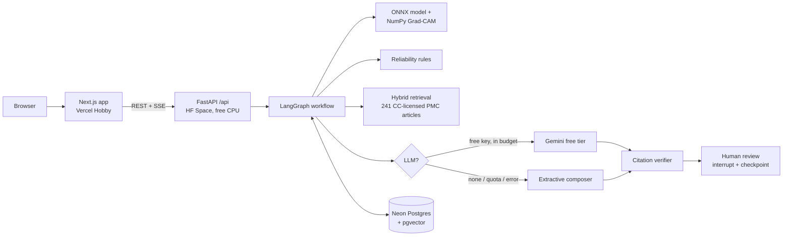
```mermaid
flowchart LR
    B[Browser] --> W[Next.js app<br/>Vercel Hobby]
    W -- REST + SSE --> A[FastAPI /api<br/>HF Space, free CPU]
    A --> G[LangGraph workflow]
    G --> V[ONNX model +<br/>NumPy Grad-CAM]
    G --> R[Reliability rules]
    G --> Q[Hybrid retrieval<br/>241 CC-licensed PMC articles]
    G --> L{LLM?}
    L -- free key, in budget --> GM[Gemini free tier]
    L -- none / quota / error --> X[Extractive composer]
    GM --> VF[Citation verifier]
    X --> VF
    VF --> H[Human review<br/>interrupt + checkpoint]
    G <--> DB[(Neon Postgres<br/>+ pgvector)]
```

| Platform result (measured 2026-11-17) | Value |
|---|---|
| Reliability rules on test: "standard" vs "caution" accuracy | **96.0%** (95% of images) vs **47.4%** (5%) |
| Retrieval, routed hybrid (bge-small): recall@10 / MRR@10, 50 labelled questions | **1.00 / 0.953**, 27 ms p50 |
| Grounded answers: fact recall, naive → full pipeline (extractive) | 0.54 → **0.66** |
| Gemini free tier through the live pipeline (34 questions) vs extractive | fact recall **0.75** vs 0.66; citation precision **0.93** vs 0.59; cites a relevant source 0.77 vs **0.97** |
| Serving per image incl. Grad-CAM: TensorFlow → ONNX | 89 → **41 ms**, 803 → **262 MB** RSS |
| Tests | 91 platform (PostgreSQL) / 88 (SQLite), 65 research, 8 web, 12 browser journeys against dev, Docker and production |
| Monthly cost | **$0** — and no configuration that can incur a charge |

Details: [docs/EVALUATION.md](docs/EVALUATION.md), including the negative
findings: Gemini answers cite a relevant source less often than extractive ones,
mostly because of a verifier rule bug the evaluation exposed (fixed afterwards;
the numbers above are as measured), and the closed-book / naive-RAG Gemini
variants were not run.

## Product tour

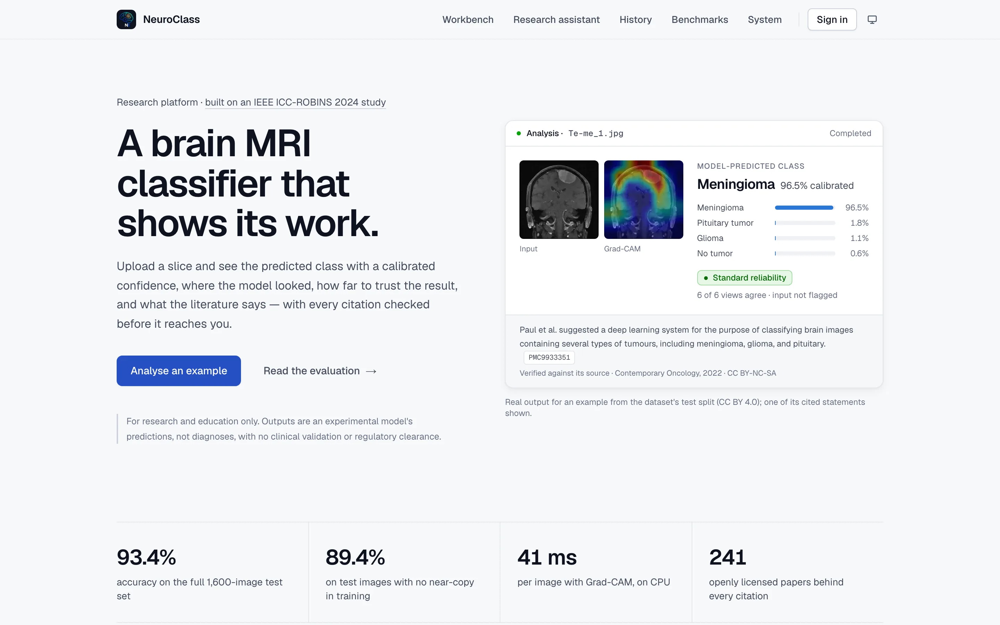

| Workbench: setup on the left, the traced result on the right | Analysis in dark mode: reliability rules and a verified, cited explanation |
|---|---|
| 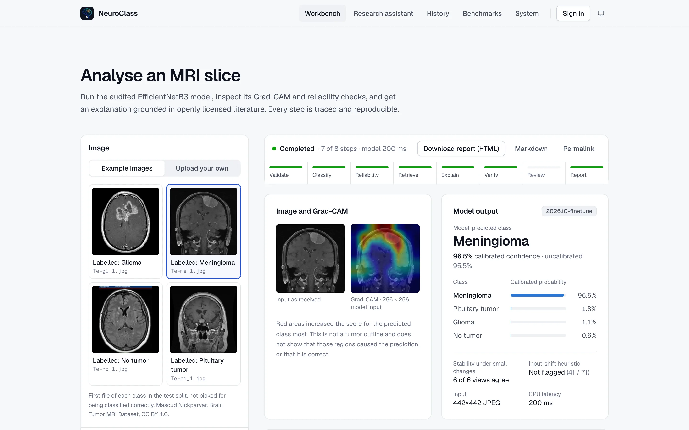 | 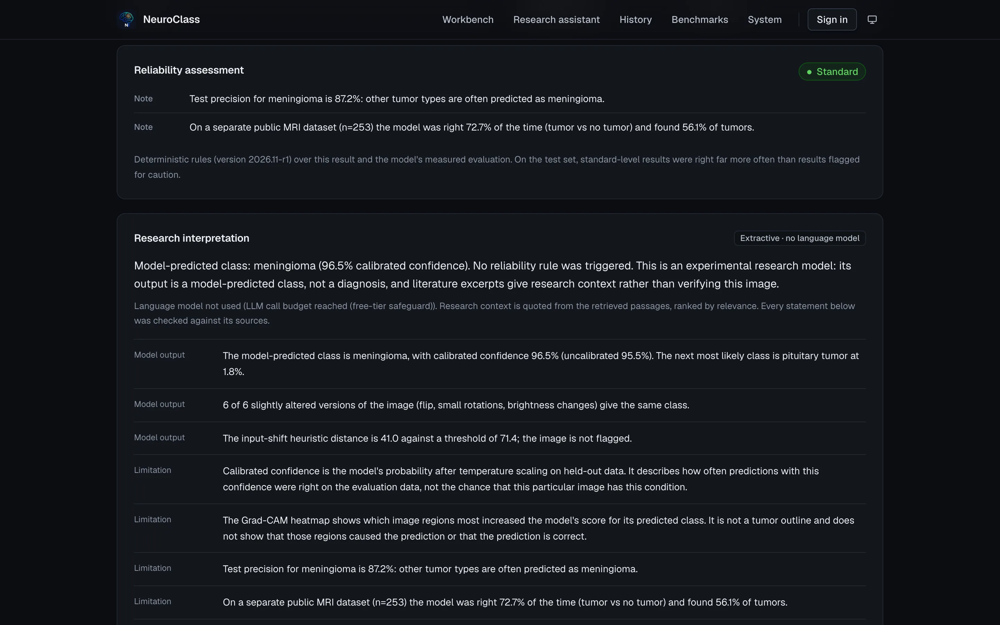 |
| **Research assistant:** answers cite passages; the verifier removes unsupported claims | **Benchmarks:** the paper's reported figures beside the audit and retraining |
| 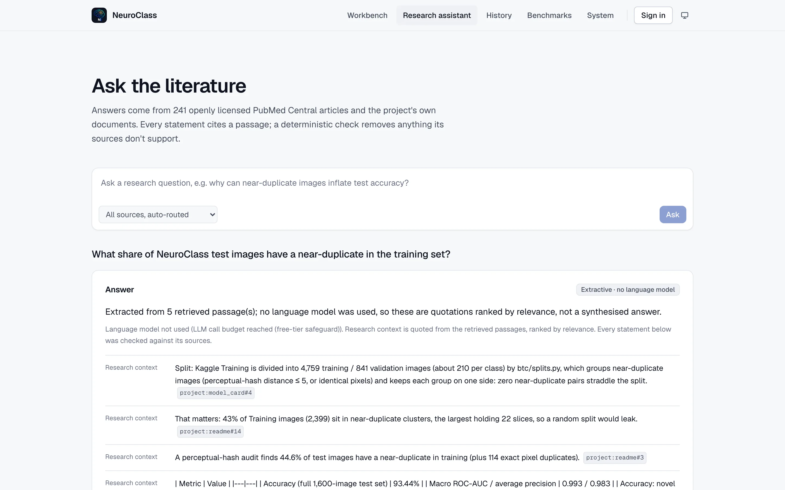 | 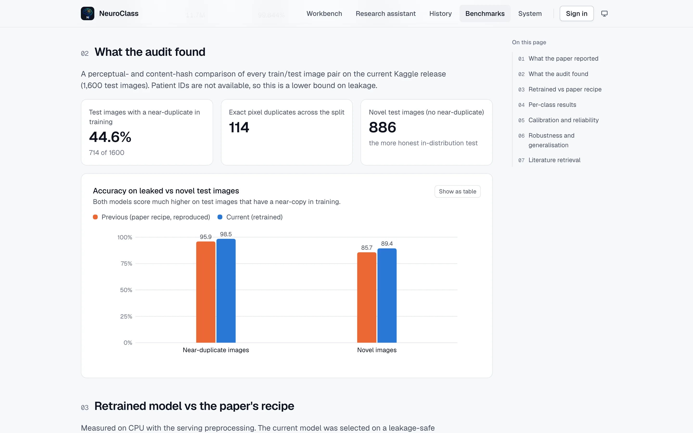 |

Screenshots of the live site, regenerated with `web/scripts/readme-screenshots.mjs`.
Light and dark themes follow the system setting, or the toggle in the header.


## Section 1 — Published Work (IEEE 2024)

> **Citation.** "Identifying Various Types of Brain Tumors using Deep Neural
> Network based Image Features," 2024 International Conference on Cognitive
> Robotics and Intelligent Systems (ICC-ROBINS), IEEE, 2024.
> DOI: [10.1109/ICC-ROBINS60238.2024.10533941](https://doi.org/10.1109/ICC-ROBINS60238.2024.10533941).
> (Author is a co-author.)

**Dataset.** Msoud Nickparvar "Brain Tumor MRI Dataset" (Kaggle) — 7,023
T1-weighted MRI images compiled from figshare, SARTAJ, and Br35H, in 4 classes,
with a predefined split of **5,712 train / 1,311 test**.

**Preprocessing.** Resize to 256×256×3 RGB; random horizontal flip.

**Benchmark (four architectures, as published).**

| Model | Backbone / head | Params | Published accuracy |
|---|---|---|---|
| CNN (from scratch) | 6× Conv(7×7)+BN+MaxPool → Dense 1024→512→4 (grayscale, SGD) | 21.4M | 98.359% |
| VGG16 | ImageNet, last conv block fine-tuned → Dense 128→4 (Adam 1e-4) | 18.9M | 99.297% |
| InceptionV3 | ImageNet, frozen → Dense 256→128→4 (Adam 1e-3) | 40.7M | 97.734% |
| **EfficientNetB3** | ImageNet, trainable, `pooling='max'` → BN → Dense 512→256→4 (Adamax 1e-3) | **11.7M** | **99.844%** |

EfficientNetB3 had the top reported accuracy and the fewest parameters (38%
fewer than VGG16), so the extension uses it as the primary subject.

### What the published numbers actually measure

Re-reading the four notebooks shows every published accuracy is an exact
fraction of a **partial** test set, not the full 1,311 images. Each notebook
evaluates with `steps = 1311 // 32 = 40` batches:

| Model | Batch size | Images scored | Published accuracy | = correct / scored |
|---|---|---|---|---|
| CNN | 32 | 1,280 (98%) | 98.359% | 1,259 / 1,280 |
| VGG16 | 32 | 1,280 (98%) | 99.297% | 1,271 / 1,280 |
| InceptionV3 | 32 | 1,280 (98%) | 97.734% | 1,251 / 1,280 |
| EfficientNetB3 | **16** | **640 (49%)** | 99.844% | **639 / 640** |

Because the test generator is not shuffled, EfficientNetB3's 640 images are the
first half of the test set in file order, not a stratified sample, and the four
models were scored on different denominators. The EfficientNetB3 notebook's own
full-test-set classification report rounds to **0.99**, so the magnitude is
roughly right; the third decimal is not supported. All four notebooks also pass
the test set as `validation_data` and keep the checkpoint with the best
`val_accuracy`, so the test set influenced model selection.

---

## Section 2 — Production Extension

> ### Headline findings
> 1. **Train/test leakage inflates the benchmark.** A perceptual-hash audit
>    finds **44.6%** of test images have a near-duplicate in training (plus
>    **114** exact pixel duplicates). The paper's model scores **95.9%** on
>    those leaked images but **85.7%** on genuinely novel ones — a ~10-point gap
>    (the current model: 98.5% vs 89.4%). Patient IDs aren't recoverable from
>    the compilation, so this is a *lower bound*.
> 2. **The published numbers were scored on partial test sets** (above).
> 3. **Apple's Metal backend computes a different function in graph mode.**
>    The paper-recipe weights score 93.81% through `tensorflow-metal`'s graph
>    mode but **90.25% on CPU**; Metal's eager mode matches CPU. CPU TensorFlow and
>    ONNX Runtime agree with each other, and CPU is what the deployed demo runs —
>    so **every metric below is measured on CPU with the serving preprocessing**,
>    the computation users are actually served.
> 4. **The deployed model was retrained and is measurably better.** Selected on
>    a leakage-safe validation split and compared once on the test set with the
>    paper-recipe model it replaced (October 2026): accuracy **90.25% → 93.44%**,
>    novel-image accuracy **85.7% → 89.4%**, glioma recall **64.3% → 79.5%**,
>    mean accuracy under corruption **67.3% → 90.7%**, raw calibration error
>    **0.188 → 0.022**; the accuracy gains are paired-significant (McNemar
>    p ≤ 3e-4). See *The current model* below.

The extension re-trains the published EfficientNetB3 recipe with exact parity,
audits it with the modules below, and replaces it with a model trained to fix
what the audit found. It never reports a number that wasn't measured:
the tables in this README are written only by `scripts/fill_readme_results.py`
from the JSON files a real run produces.

### Modules
| # | Module | Code | Output |
|---|---|---|---|
| 0 | **Training the deployed model** (two-stage fine-tune) | [`finetune.py`](src/btc/finetune.py) | `models/EfficientNetB3_model_weights.h5` |
| 0b | Parity reproduction of the paper (+ BatchNorm recalibration) | [`train.py`](src/btc/train.py) | `models/EfficientNetB3_parity_weights.h5` |
| 1 | Evaluation (P/R/F1, confusion matrix, ROC-AUC, PR) | [`evaluate.py`](src/btc/evaluate.py) | `results/metrics/evaluation.json`, figures |
| 2 | **Leakage audit** | [`leakage.py`](src/btc/leakage.py) | `results/metrics/leakage.json` |
| 3 | External / out-of-distribution validation | [`external_validation.py`](src/btc/external_validation.py) | `results/metrics/external_validation.json` |
| 4 | Calibration (ECE + temperature scaling) | [`calibration.py`](src/btc/calibration.py) | `results/metrics/calibration.json`, reliability diagram |
| 5 | Explainability (compiled Grad-CAM) | [`explain.py`](src/btc/explain.py) | `results/figures/gradcam_montage.png` |
| 6 | Robustness to corruptions | [`robustness.py`](src/btc/robustness.py) | `results/metrics/robustness.json`, curves |
| 7 | Uncertainty (test-time augmentation) | [`uncertainty.py`](src/btc/uncertainty.py) | `results/metrics/uncertainty.json` |
| 8 | Drift monitoring stub (PCA + PSI) | [`monitoring.py`](src/btc/monitoring.py) | `models/drift_reference.npz`, `drift_log.jsonl` |
| 9 | ONNX export + latency benchmark | [`export_onnx.py`](src/btc/export_onnx.py) | `models/efficientnetb3.onnx`, `latency.json` |
| 10 | Serving: original Gradio app + FastAPI (TensorFlow), superseded in deployment by the platform (Section 3) | [`space/app.py`](space/app.py), [`serve/app.py`](src/btc/serve/app.py) | Space tag `tf-gradio5-2026-10`, REST API |
| 11 | Packaging, tests, CI | [`Dockerfile`](Dockerfile), [`requirements.txt`](requirements.txt), [`tests/`](tests/), [`ci.yml`](.github/workflows/ci.yml), [`MODEL_CARD.md`](MODEL_CARD.md) | pinned deps, lint + 65 tests on every push, verified Docker image |

### Results of the deployed model (measured on CPU)

<!-- RESULTS:BEGIN -->
> Auto-generated by `scripts/fill_readme_results.py` from `results/metrics/*.json` produced by `scripts/reproduce.sh`. Every value is measured — no placeholders.

| Metric | Value |
|---|---|
| Deployed model accuracy (full test set) | 93.44% |
| Published reference (paper) | 99.844% |
| Macro ROC-AUC / avg-precision | 0.993 / 0.983 |
| Exact cross-split duplicates | 114 / 1600 (7.1%) |
| Near-duplicates (phash≤5) | 714 / 1600 (44.6%) |
| Accuracy on near-duplicate vs leak-free images | 98.5% vs 89.4% |
| External OOD accuracy (binary collapse, n=253) | 72.7% |
| ECE before → after temperature scaling | 0.0222 → 0.0239 (T=0.937, fit on val report on test) |
| Single-image latency, Keras-CPU / ONNX-CPU / ONNX-CoreML | 78ms / 35ms / 20.3ms |
<!-- RESULTS:END -->

### Per-class performance

<!-- PERCLASS:BEGIN -->
| Class | Precision | Recall | F1 | ROC-AUC | Support |
|---|---|---|---|---|---|
| glioma | 0.978 | 0.795 | 0.877 | 0.984 | 400 |
| meningioma | 0.872 | 0.950 | 0.909 | 0.990 | 400 |
| notumor | 0.930 | 0.998 | 0.963 | 0.999 | 400 |
| pituitary | 0.971 | 0.995 | 0.983 | 0.999 | 400 |

**Weakest class: glioma.** Of 400 glioma test images, 54 are predicted as meningioma and **25 (6.2%) as `notumor`** — a missed-tumor error, the most consequential failure mode for any screening use.
<!-- PERCLASS:END -->

### Figures (generated by the run)

| Confusion matrix | Per-class ROC | Reliability diagram |
|---|---|---|
| 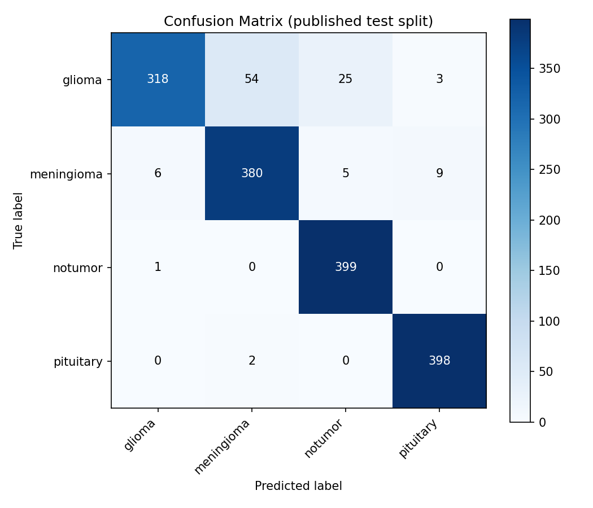 | 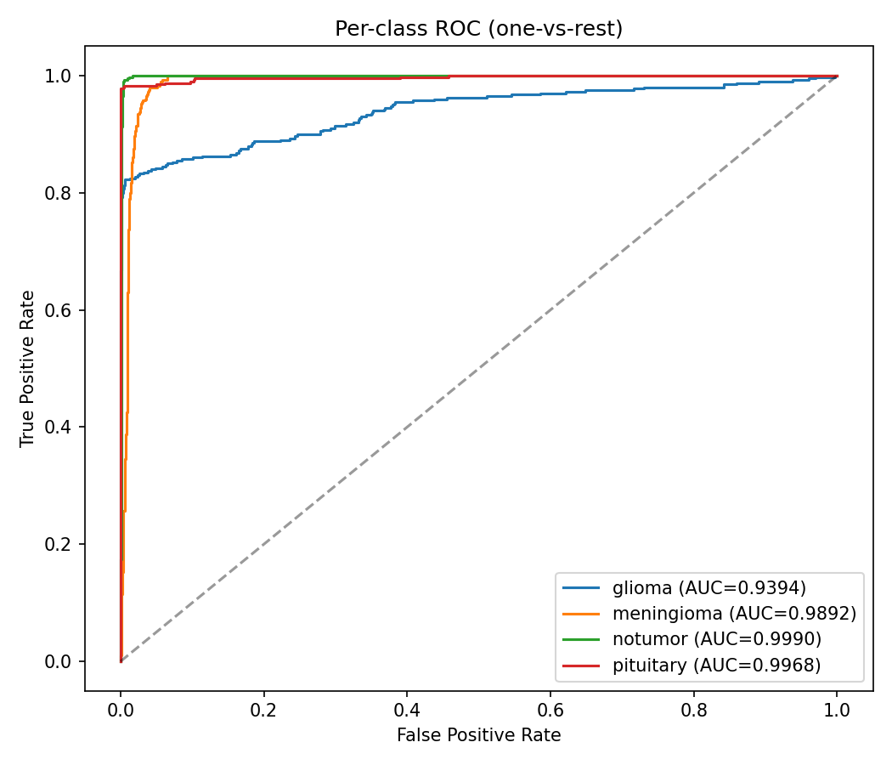 | 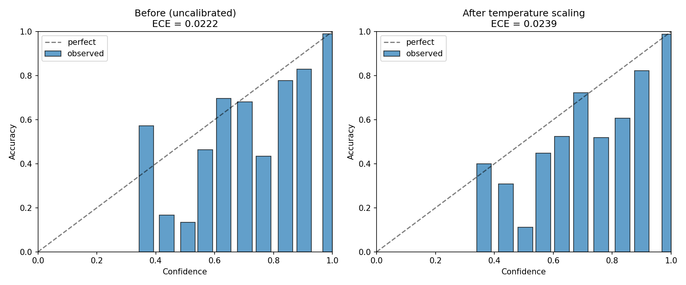 |

| Leakage proximity histogram | Grad-CAM overlays (4 classes, correct & wrong) |
|---|---|
| 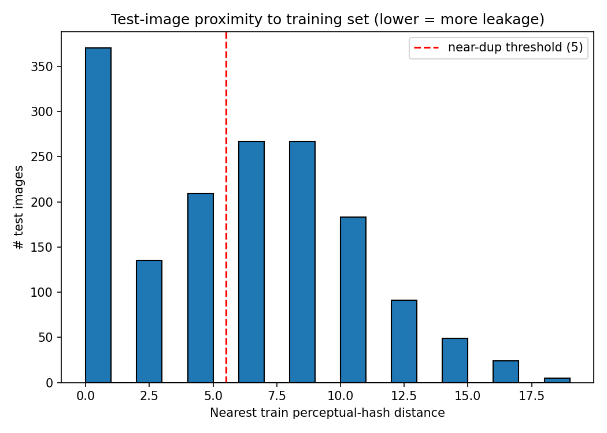 | 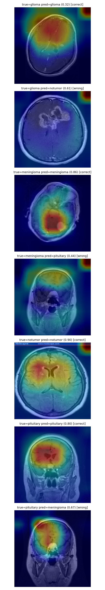 |

Per-class precision-recall curves: [`results/figures/pr_curves.png`](results/figures/pr_curves.png).

### Robustness & uncertainty (measured)

<!-- ROBUSTNESS:BEGIN -->
**Robustness to common corruptions** (accuracy at severity 1 / 3 / 5; clean = 92.0%):

| Corruption | sev 1 | sev 3 | sev 5 |
|---|---|---|---|
| gaussian_noise | 92% | 91% | 85% |
| gaussian_blur | 92% | 90% | 80% |
| brightness | 92% | 92% | 92% |
| contrast | 92% | 93% | 92% |
| jpeg_compression | 92% | 92% | 87% |
| rotation | 93% | 91% | 87% |
| **mean corrupted** | | | **90.7%** |

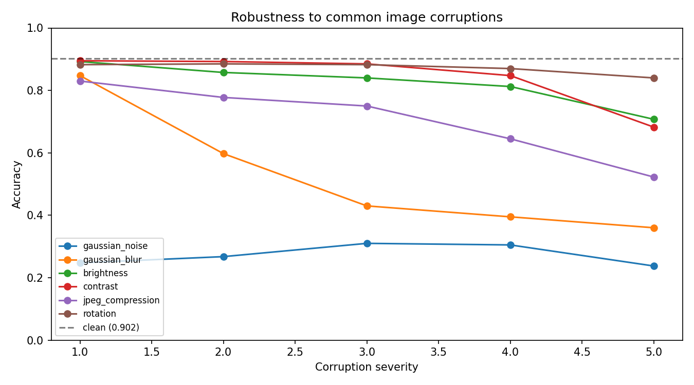

**Uncertainty (Test-Time Augmentation):** mean predictive entropy **0.11 on correct** vs **0.78 on wrong** predictions (n=200) — the model is measurably less certain when it errs.
<!-- ROBUSTNESS:END -->

Entropy is about 7× higher on wrong predictions than on correct ones (the
previous model: 1.02 vs 0.82). These are averages and say nothing about how far
the two distributions overlap, so entropy should be one input to a "flag for
review" rule rather than a threshold on its own.

### Evaluation limitations (read this)

- **Train/test leakage (most important).** The published split is **image-level**
  over a multi-source compilation of 3-D scans. One patient yields many
  near-identical adjacent slices, and an image-level split can place siblings on
  both sides, so the model can recognise a test slice from a memorised training
  sibling. **Patient/scan IDs are not recoverable** from the Kaggle release (flat
  per-class JPGs, re-indexed filenames; SARTAJ/Br35H never carried IDs), so the
  leakage module reports an image-similarity **lower bound** and re-scores
  accuracy on the leak-free subset.

- **The paper's recipe used the test set for model selection.** Both the
  paper's notebooks and this repo's parity reproduction pick the checkpoint with
  the best `val_accuracy`, where validation *is* (part of) the test set, which
  biases their test metrics upward. The current model is selected on a
  leakage-safe validation split carved out of Training (`btc.splits`) and was
  scored on the test set once.

- **Metal graph-mode defect (root cause found).** On Apple Silicon,
  `tensorflow-metal` 1.1.0 computes the right function in *eager* mode (matches
  CPU to ~4e-6) but a different one in *graph* mode — `tf.function`, and so
  Keras `predict` and `fit`. For the deployed weights on the test set: CPU
  **90.25%**, Metal graph mode 93.81% (3.6% of predictions flipped). Turning off
  grappler's meta-optimizer makes Metal match CPU exactly (max difference
  1.2e-5, no flips); turning off any single built-in pass does not, which points
  at the plugin's own graph optimizer. The parity model was trained with `fit`
  on Metal, i.e. likely against the defective function, which would explain why
  that function scores higher than the deployed one. All evaluation and serving
  is pinned to CPU by `config.configure_inference_device()`;
  `config.disable_metal_graph_optimizer()` is the workaround when a GPU is used.
  Even with it, Metal gradients differ from CPU (median 4.7% on per-variable
  gradient norms), so training defaults to CPU.

- **Train/serve preprocessing skew (fixed).** Evaluation used to resize with
  Keras `load_img` (nearest-neighbour, as in the published notebooks) while
  both serving paths resize with PIL's default (bicubic), so the previous
  model's reported 91.25% described a computation nobody was served; measured
  on the serving path it scores **90.25%**. Every evaluation loader now uses
  `btc/preprocess.py`, the serving function (a test guards it, and another
  asserts the Space's preprocessing is byte-identical), and the current model
  is also *trained* on it, so it has no skew. The parity reproduction still
  resizes as published.

- **BatchNorm recalibration (previous model).** Under the published recipe (momentum 0.99,
  batch 16) the backbone's BatchNorm running statistics did not converge on
  Metal, so raw inference collapsed toward one class. `train.py` re-estimates
  those statistics with forward passes over training data (no weight update).
  Re-estimating them on CPU instead was tried and scored lower on CPU (89.19% vs
  91.25%, both under the previous evaluation preprocessing), so the current
  weights were kept. In hindsight the collapse is likely another symptom of the
  Metal graph-mode defect, which `fit` trained through.

- **Dataset drift since publication.** The live Kaggle dataset has been
  rebalanced since the paper: **5,600 train / 1,600 test (1,400 / 400 per
  class)** versus the paper's **5,712 / 1,311**. Reproduced numbers are on this
  different test set; `data.py` warns when counts differ.

- **Calibration protocol.** The temperature is fit on the validation split and
  ECE is reported on the test set, which played no part in fitting
  (`python -m btc.calibration`). The previous model trained on all of Kaggle
  Training, so its temperature had to be fit on the test set
  (`--fit-on test`, optionally `--holdout 0.5`).

- **Steps-per-epoch quirk (faithful reproduction).** The published notebook uses
  `steps_per_epoch = 5712 // 32 = 178` with batch size 16, so each epoch sees
  ~2,848 images rather than all 5,712. Preserved exactly for parity.

- **External validation taxonomy.** The out-of-distribution set is binary
  (tumor / no tumor), so the 4-class model is scored by collapsing its three
  tumor classes into one.

### The current model: how it was trained and validated

**A leakage-safe validation split.** `python -m btc.splits` carves 841
validation images (about 210 per class) out of Kaggle Training. It first groups
images into near-duplicate clusters (perceptual-hash distance ≤ 5, or identical
pixels) and keeps every cluster on one side. That matters: **43% of Training
images (2,399) sit in near-duplicate clusters**, the largest holding 22 slices,
so a random split would leak. Verified: **zero** near-duplicate pairs straddle
train and validation (the official test set has 714). The split is saved to
`results/splits/train_val_split.json`.

**The recipe** ([`finetune.py`](src/btc/finetune.py)) targets each weakness
measured on the paper's model. It trains on CPU (the deployed computation) with
the serving preprocessing, on the 4,759-image training side of the split, and
selects every checkpoint, learning-rate step and early stop on validation. It
is the standard two-stage EfficientNet fine-tune:

1. **Head only**, on cached features of the frozen ImageNet backbone (each
   training image and its mirror), Adamax 1e-3 — 17 seconds once the features
   are cached (2.5 min).
2. **Fine-tune from `block6a` up** with flips, small rotations/zooms/shifts,
   brightness/contrast and Gaussian noise, Adamax 1e-4 decayed on plateaus,
   BatchNorm frozen throughout. Backpropagation stops at 16×16 feature maps, so
   an epoch costs ~2.2 min on an M3 Pro CPU instead of ~6 for a full fine-tune.

Total training time: **21.5 minutes on a laptop CPU**. Every run writes its
config, seed, split hash, git revision, hardware, per-epoch history and
checkpoints to a gitignored `runs/` directory and resumes after an
interruption; the deployed model's record is
[`training.json`](results/metrics/training.json).
[`finetune_sanity_checks.py`](scripts/finetune_sanity_checks.py) runs seven
pre-flight checks first (label mapping, forward pass, frozen BatchNorm, finite
gradients, augmentation, an overfit test, graph mode == eager).

**Selection, on validation only.** Rule fixed before comparing: higher
validation accuracy wins unless the gap is under 1 point, then higher mean
accuracy under corruption. Head-only scored 96.79% vs 96.31% for the fine-tuned
model (a 4-image gap), so robustness decided: **92.4% vs 79.2%** mean accuracy
under the 30 corruption conditions on validation. Test-time augmentation moved
validation accuracy by ±0.24 points (+0.24 for one candidate, −0.24 for the
other) and was **not adopted**.

**One test-set comparison with the model it replaced**
([`model_comparison.json`](results/metrics/model_comparison.json), written by
[`compare_models.py`](scripts/compare_models.py)):

<!-- UPGRADE:BEGIN -->
| Metric (CPU, serving preprocessing) | Previous (parity, 2024) | **Current** |
|---|---|---|
| Test accuracy (n=1600) | 90.25% | 93.44% |
| Novel-image subset accuracy (n=886) | 85.67% | 89.39% |
| Near-duplicate subset accuracy | 95.94% | 98.46% |
| Macro F1 | 0.898 | 0.933 |
| Glioma recall (novel subset) | 64.25% (63.06%) | 79.50% (75.16%) |
| Gliomas predicted `notumor` (of 400) | 33 | 25 |
| Cross-entropy (lower is better) | 0.496 | 0.204 |
| ECE raw → temperature-scaled | 0.188 → 0.065 | 0.022 → 0.024 |
| Mean accuracy over 30 corruptions (n=400) | 67.32% | 90.68% |
| External OOD accuracy (n=253) | 69.57% | 72.73% |
| External tumor recall / no-tumor specificity | 50.32% / 100.00% | 56.13% / 98.98% |

Paired significance (exact McNemar): full test: 81 images only the current model gets right vs 30 only the previous one does, p = 1.4e-06; novel subset: 56 images only the current model gets right vs 23 only the previous one does, p = 2.6e-04; glioma: 70 images only the current model gets right vs 9 only the previous one does, p = 7.8e-13.

Calibration: previous — T fit on half the test set, ECE on the other half; current — T fit on the validation split, ECE on the full test set (T = 0.937).
<!-- UPGRADE:END -->

The current model needs little calibration: its raw ECE is already 0.022, and
the temperature fit on validation (T = 0.937) leaves test ECE essentially
unchanged. It had less training data than the previous model (4,759 vs 5,600
images; the rest is its validation split), and the previous model's checkpoint
was chosen on the test set, which flatters it — so the comparison, if anything,
favours the previous model. Glioma is still the weakest class: 25 of 400 glioma
test images (6.25%) are called `notumor`. Results come from a single training
seed.

**Two silent bugs found on the way, both fixed and guarded:**
- *Metal graph mode* (above): a first 3-epoch run on Metal reported 73.8%
  validation accuracy for a checkpoint that scores 71.6% on CPU. Training now
  defaults to CPU, and pre-flight check 7 fails on the defect.
- *A Keras architecture quirk*: EfficientNet gets an extra input layer,
  `Rescaling(1/sqrt(ImageNet std))`, only when built with
  `weights="imagenet"` (tensorflow#49930). The recipe trains from ImageNet
  weights; the evaluation and serving code builds with `weights=None`, so a raw
  checkpoint loaded there silently scored 86.7% instead of 95.0% on a
  validation sample. `export_for_serving()` folds the layer into the input
  `Normalization` variance — an exact identity, verified to 1e-6 and checked on
  every export — so the model runs on the unchanged serving architecture. (The
  previous model never had the layer at inference and is unaffected.)

**Rollback.** Every deployed model generation is preserved: the previous
model's weights, ONNX, live temperature (T = 0.561) and evaluation outputs are
in `models/archive/parity-2024/` with SHA-256 checksums, its metrics and
figures in [`results/archive/parity-2024/`](results/archive/parity-2024/), and
on the Hub at tag `parity-2024` (model repo and Space). The current model's
artifacts and one-time evaluation are in `models/archive/retrain-2026-10/`.
Two ways back:

- *Quick*: restore the Space from its tag `tf-gradio5-2026-10` (the last
  TensorFlow/Gradio-5 version) and set the Space variable
  `NEUROCLASS_REVISION=parity-2024`; that app then serves the previous model.
- *Full*: copy the previous model's files from the model repo's `parity-2024`
  tag back onto `main`, and restore the Space's code from its own
  `parity-2024` tag.

### Roadmap
1. Target the remaining glioma → `notumor` misses (6.25% on test).
2. Report results over several training seeds instead of one.
3. Run the generation evaluation's LLM variants with a free-tier Gemini key.

---

## Section 3 — Research Platform (2026, not part of the paper)

| Capability | How | Evidence |
|---|---|---|
| **TF-free inference** | one ONNX graph outputs probabilities and the last conv map; Grad-CAM is computed in closed form through the dense head ([`serving_math.py`](src/btc/serving_math.py)); the export refuses to write a manifest unless it matches TensorFlow | probabilities within 5e-6 of TF on all 1,600 test images, heatmaps within 9e-6; 41 vs 89 ms |
| **Reliability assessment** | deterministic rules over calibrated confidence, 6-view TTA agreement, a Mahalanobis input-shift distance and the model's measured weaknesses ([`reliability.py`](src/neuroclass/reliability.py)) | test: standard 96.0% accurate, caution 47.4%; the input-shift heuristic flags non-MRI inputs (AUROC 0.95) but not other MRI datasets (0.52) — labelled a heuristic |
| **Agent workflow** | LangGraph: validate → infer → assess → retrieve → explain → verify → human review (`interrupt`) → report; typed state, retries, bounded revisions, SQLite/Postgres checkpoints, per-step traces streamed over SSE ([`graph.py`](src/neuroclass/agent/graph.py)) | a review paused before an API restart resumes after it (Postgres) |
| **Scientific RAG** | 241 PubMed Central open-access articles with a declared CC licence (ND excluded) + project docs; section-aware chunks; BM25 + local bge-small embeddings, RRF, routing, per-document cap; pgvector or in-process ([`rag/`](src/neuroclass/rag/)) | recall@10 1.00 on 50 labelled questions; embedders and reranking compared |
| **Verified explanations** | statements must cite retrieved passages; numbers must appear in their sources or the inference; unsupported statements are removed and shown with reasons ([`verify.py`](src/neuroclass/agent/verify.py)) | tested with scripted LLM outputs that invent ids and numbers |
| **LLM, free-first** | provider abstraction; Gemini free tier when a key is set, behind a per-minute/per-day quota guard with 429 back-off; extractive fallback with the reason shown; paid Claude adapter refused unless explicitly allowed ([`llm.py`](src/neuroclass/agent/llm.py)) | [ADR 0002](docs/adr/0002-zero-cost-deployment.md) |
| **API** | FastAPI, Pydantic, Alembic, JWT + anonymous client ids, owner scoping, rate limits, request ids, idempotency, SSE, report export, retention job ([`api/`](src/neuroclass/api/)) | [docs/API.md](docs/API.md) |
| **Web app** | Next.js 16, TypeScript, Tailwind; workbench, research assistant, history, benchmarks (charts with table views), system status, review queue; generated API types | Vitest + Playwright (desktop + mobile) |
| **MLOps** | model registry, promotion gate with tolerances and a paired McNemar check ([`registry.py`](src/neuroclass/registry.py)), Hub tags for rollback, reproducible evaluation scripts | `results/metrics/promotion_gate.json` |
| **MCP** | narrow read-only MCP server (benchmarks, model info, reproducibility, literature) for local use ([`mcp_server.py`](src/neuroclass/mcp_server.py)) | annotations tested |

Design notes: [docs/ARCHITECTURE.md](docs/ARCHITECTURE.md) ·
security and privacy: [docs/SECURITY.md](docs/SECURITY.md) ·
data, licences and limitations: [docs/PROVENANCE.md](docs/PROVENANCE.md) ·
the engineering story: [docs/CASE_STUDY.md](docs/CASE_STUDY.md).

---

## Deployment ($0)

| Layer | Service (free plan) | Without it |
|---|---|---|
| API | existing Hugging Face Space, CPU Basic (API-only) | — |
| Web app | Vercel Hobby (deploys on push to `main`) | the API docs |
| Database + pgvector | Neon Free | in-memory retrieval and 503 for data features if Neon is suspended |
| LLM | Gemini API free tier, unbilled project (configured) | extractive answers |
| Embeddings | local ONNX (fastembed) | — |

No paid plan, card or add-on is used, and free-tier exhaustion degrades a
feature instead of charging. Step-by-step setup, limits and maintenance:
[docs/DEPLOYMENT.md](docs/DEPLOYMENT.md) and [docs/FREE_TIER.md](docs/FREE_TIER.md).

---

## Quickstart

**Platform (no TensorFlow, no GPU, no keys):**
```bash
python3.11 -m venv .venv-app && .venv-app/bin/pip install -r requirements-app.txt && .venv-app/bin/pip install -e . --no-deps
```
```bash
docker compose -f deploy/docker-compose.yml up --build
```
Web on http://localhost:3000, API docs on http://localhost:8000/docs. The
serving bundle (`models/serving`) and the literature index (`data/rag_index`)
are build artifacts: create them with `python -m btc.export_serving` (research
environment) and `python -m neuroclass.rag.corpus fetch && python -m neuroclass.rag.corpus build && python -m neuroclass.rag.index build`.

```bash
PYTHONPATH=src .venv-app/bin/pytest tests/app_tests -q
```
```bash
cd web && npm ci && npm test && npm run build
```

**Research (TensorFlow 2.15, Python 3.11):**
```bash
bash scripts/setup_env.sh && source .venv/bin/activate
```
```bash
bash scripts/download_data.sh
```
```bash
bash scripts/reproduce.sh            # add --skip-train to reuse existing weights
```
```bash
PYTHONPATH=src pytest tests/ -q --ignore=tests/app_tests
```

Evaluations: `scripts/eval_reliability.py`, `scripts/eval_rag.py --rerank`,
`scripts/eval_generation.py`, `scripts/bench_serving.py` — see
[docs/EVALUATION.md](docs/EVALUATION.md). All settings:
[docs/CONFIGURATION.md](docs/CONFIGURATION.md).

### Research-model service (TensorFlow)
The original `btc.serve` FastAPI service and root [`Dockerfile`](Dockerfile)
still serve the Keras model (`POST /predict`); the verified details are in
[PROJECT_DOCUMENTATION_NeuroClass.md](PROJECT_DOCUMENTATION_NeuroClass.md).
The platform API supersedes it for deployment.

## Environment & dependencies

Two environments, on purpose: `.venv` (research; TensorFlow 2.15 / Keras 2,
needed for parity, Python 3.9–3.11 only) and `.venv-app` (platform; no
TensorFlow, pinned in [`requirements-app.txt`](requirements-app.txt)). The
Space installs the platform pins adjusted for Gradio's extras
([`deploy/hf_space/build.py`](deploy/hf_space/build.py)); CI installs that exact
set and runs the platform tests on it.

**Security.** `pip-audit` reports no known vulnerabilities in
`requirements-app.txt`, and `npm audit` none in the web app's production
dependencies (both run in CI). Moving the Space from Gradio 5.50 to 6.32 removed
the Pillow < 12 and Starlette < 1.0 caps that had blocked fixes. The research
environment still carries advisories that the TF 2.15 parity requirement blocks
(Keras 2.15, ONNX ≤ 1.18, Protobuf < 5); it is not deployed.

## Repository layout
```
legacy/                 original IEEE 2024 notebooks — byte-for-byte, read-only
src/btc/                research package: reproduction, audit, training, evaluation, export
src/neuroclass/         platform: vision, reliability, rag, agent, api, db, registry, mcp_server
web/                    Next.js app (workbench, assistant, history, benchmarks, system, review)
deploy/                 docker-compose (local stack), hf_space/ (Space entrypoint + build)
scripts/                reproduce, evaluate_candidate, eval_reliability, eval_rag,
                        eval_generation, bench_serving, export_openapi, ...
evals/                  labelled retrieval/generation questions with gold facts
tests/                  research tests (no TF) and tests/app_tests (platform)
results/                metrics, figures, retrieval/generation evaluations (tracked)
docs/                   architecture, API, configuration, deployment, free tier, security,
                        evaluation, provenance, case study, demo script, ADRs
models/                 registry.json, serving manifest (weights are build artifacts)
```

## Documentation
| | |
|---|---|
| [MODEL_CARD.md](MODEL_CARD.md) | intended use, data, metrics, limitations of the model |
| [PROJECT_DOCUMENTATION_NeuroClass.md](PROJECT_DOCUMENTATION_NeuroClass.md) | the full project documentation |
| [docs/ARCHITECTURE.md](docs/ARCHITECTURE.md) · [docs/API.md](docs/API.md) · [docs/CONFIGURATION.md](docs/CONFIGURATION.md) | how the platform works |
| [docs/DEPLOYMENT.md](docs/DEPLOYMENT.md) · [docs/FREE_TIER.md](docs/FREE_TIER.md) | running it for $0 |
| [docs/EVALUATION.md](docs/EVALUATION.md) · [docs/PROVENANCE.md](docs/PROVENANCE.md) · [docs/SECURITY.md](docs/SECURITY.md) | evidence, sources, limits |
| [docs/CASE_STUDY.md](docs/CASE_STUDY.md) · [docs/DEMO_SCRIPT.md](docs/DEMO_SCRIPT.md) | the story and a 4-minute demo |
| [docs/adr/](docs/adr/) | architecture decision records |

